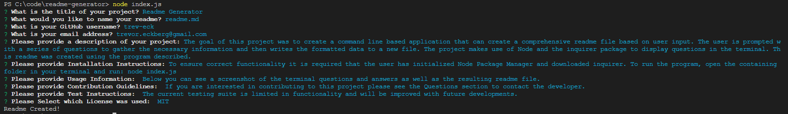
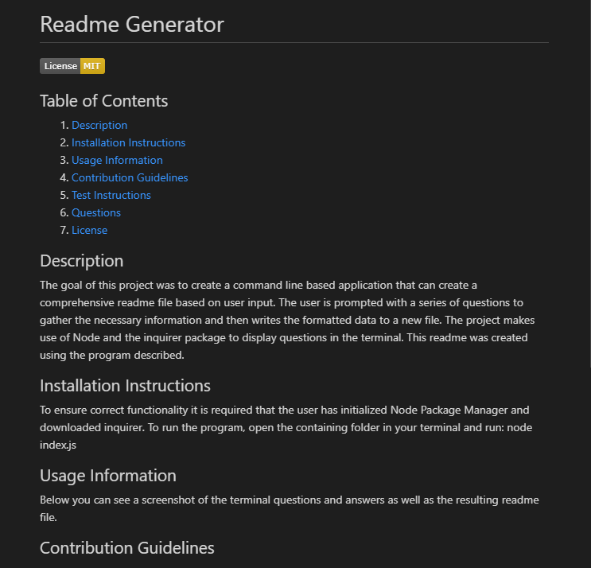

# Readme Generator

## Table of Contents
    
1. [Description](##description)
2. [Installation Instructions](##installation-instructions)
3. [Usage Information](##usage-information)
4. [Contribution Guidelines](##contribution-guidelines)
5. [Test Instructions](##test-instructions)
6. [Questions](##questions)
7. [License](##license)
    
    
    
## Description
The goal of this project was to create a command line based application that can create a comprehensive readme file based on user input. The user is prompted with a series of questions to gather the necessary information and then writes the formatted data to a new file. The project makes use of Node and the inquirer package to display questions in the terminal. This readme was created using the program described.
    
## Installation Instructions
To ensure correct functionality it is required that the user has initialized Node Package Manager and downloaded inquirer. To run the program, open the containing folder in your terminal and run: node index.js
    
## Usage Information
Below you can see a screenshot of the terminal questions and answers as well as the resulting readme file.

    
## Contribution Guidelines
If you are interested in contributing to this project please see the Questions section to contact the developer.
    
## Test Instructions
The current testing suite is limited in functionality and will be improved with future developments.
    
## Questions
If you have further questions about the functionality of this application or need clarification regarding certain areas the creator can be contacted at: 
Email: trevor.eckberg@gmail.com  
Github: github.com/trev-eck/
    
## License
This application was developed under the MIT License
    
